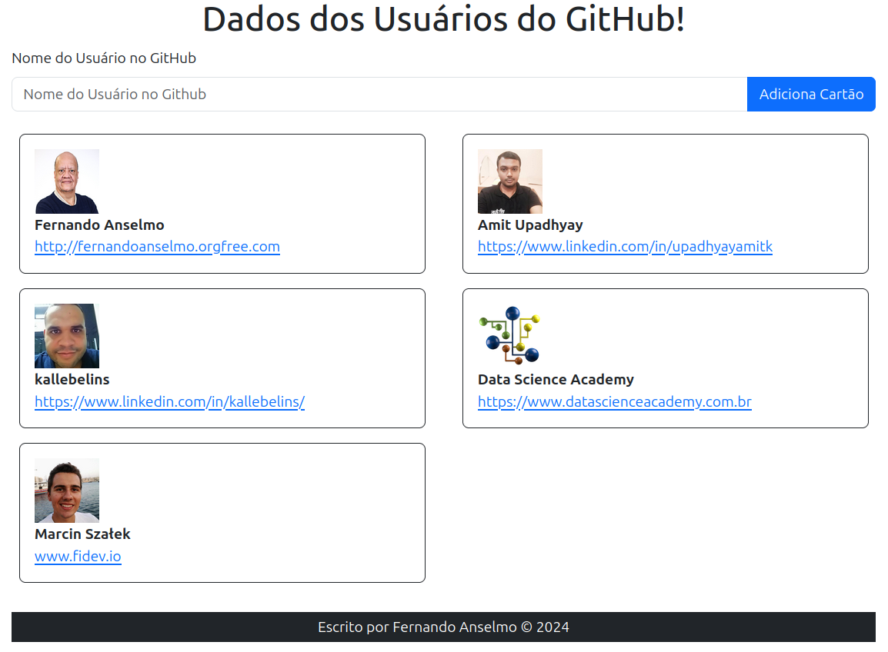

# Projeto Meus Clientes: Front-End
Este é um projeto utiliza "React + Axios + Bootstrap". Para buscar um usuário do GitHub e trazer alguns dados montando um cartão na tela:



Ativar o Back acessar a aplicação em: http://localhost:3000

## Ferramentas Utilizadas
Foram utilizadas as seguintes tecnologias:
* React.js 18.3.1
* Node.js 18.20.4
* npm 18.3.1
* Bootstrap 5.3.3
* Axios 1.7.7

## Compilar
Este projeto utiliza o Node e NPM para o gerenciamento dos pacotes, para iniciar o projeto:
```
npm start
```

Uma vez ativado, o navegador será chamado e redirecionado para a porta 3000. Agora basta colocar o nome dos usuários do GitHub na tela para ver o cartão sendo criado.